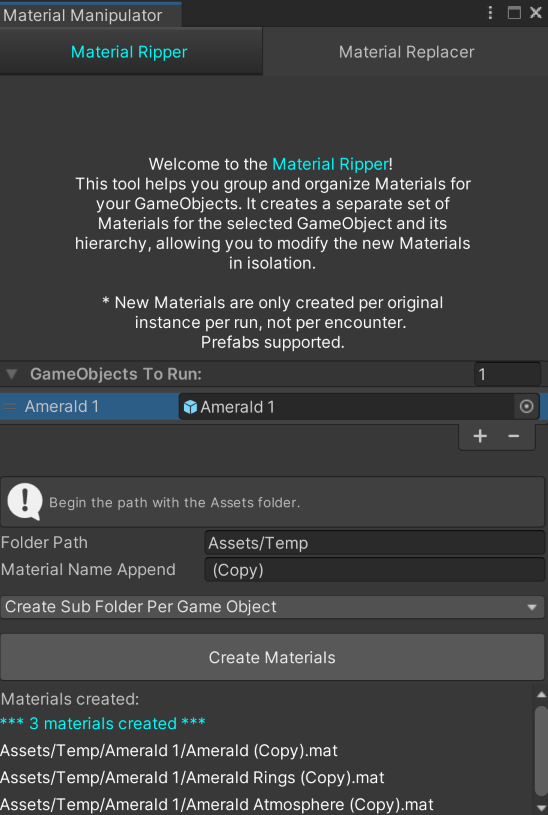

<!-- PROJECT LOGO -->
 

<!--
  
  -->

<h1 align="center">Material Manipulator</h1>

<!-- ABOUT THE PROJECT -->
## About The Project

This is a Unity Custom Asset. For Unity implementation see the documentation sub folder.

### Built With

[![Next][C#.csharp]][MicrosoftLearn-url]

<!-- GETTING STARTED -->
## Getting Started

See Unity specific documentation within the Assets folder.

### Prerequisites

Unity

### Installation

Clone the repo to you local machine. Note the folder.

Using the Unity Package Manager > top left > "Import From Disk". Navigate to the repo.

Choose to import the samples within the package manager options if available.

<!-- LICENSE -->
## License

MIT

(<a href="#readme-top">back to top</a>)

<!-- MARKDOWN LINKS & IMAGES -->
<!-- https://www.markdownguide.org/basic-syntax/#reference-style-links -->
[C#.csharp]: https://img.shields.io/badge/c%23-%23239120.svg?style=for-the-badge&logo=c-sharp&logoColor=white
[MicrosoftLearn-url]: https://img.shields.io/badge/Microsoft_Learn-258ffa?style=for-the-badge&logo=microsoft&logoColor=white
